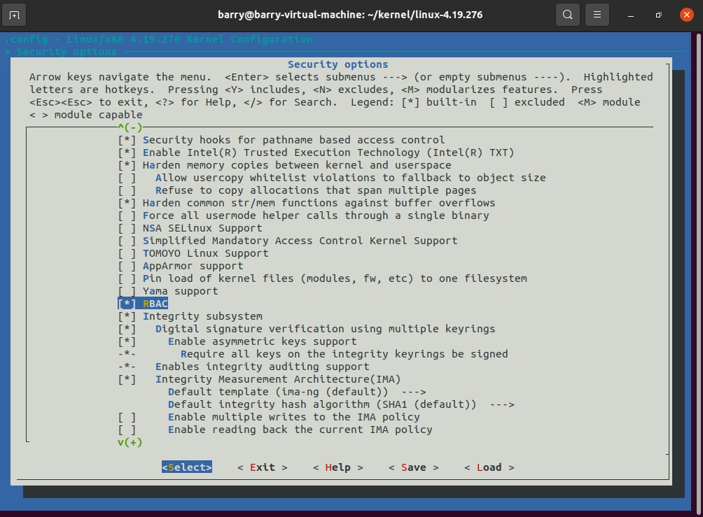

# 基于LSM的RBAC模块实验

模块命名：`rbac_lsm`

## 环境配置

内核版本：4.19.276

经测试发现安全模块不再支持动态加载到内核，因此选择将模块编译到内核。

修改kernel文件的各个Kconfig、Makefile：本仓库根目录下的`Kconfig`、`Makefile`、`rbac`放入内核代码的`security`文件夹中。


然后在`make menuconfig`中启用本安全模块，并关闭其他安全模块：



然后编译并安装内核，更新grub，重启切换到编译好的内核。

## 配置

### 开关

通过`/etc/rbac/switch`中的值决定本模块的开关，开的时候该安全功能发挥作用，关闭时不发挥作用。

取值为`0`表示关，`1`表示开。

### 配置权限

一个角色可对应多个权限，本次实验实现的权限有：

删除目录 `MKDIR`、创建目录 `RMDIR`。

通过`/etc/rbac/role_perm_mapping`文件配置角色到权限的映射关系，格式：

> role_name=permission1,permission2,...

本次实验使用的配置：

```
remover=RMDIR
creater=MKDIR
admin=RMDIR,MKDIR
```

### 配置角色

一个用户对应一个角色，通过`/etc/rbac/user_role_mapping`文件配置用户到角色的映射关系，格式：

> uid=role_name

本次实验使用的配置：

```
1001=remover
1002=creater
1003=admin
```

不在配置中的用户则默认包含所有权限。

## 原理概述

1. 使用`security_add_hooks`添加创建目录和删除目录的钩子函数
2. 当权限对应的钩子函数触发时：
   1. `load_switch()`检查模块开关，如果关闭则允许操作；
   2. `load_roles_config()`加载角色；
   3. `load_users_config()`加载用户；
   4. `check_permission(uint action)`通过对比当前用户对应角色是否具有操作`action`的权限，返回允许或禁止该操作。

P.S. 权限检查通过按位比较实现，最低位取`1`表示具有`RMDIR`权限，次低位取`1`表示具有`MKDIR`权限。

具体逻辑见代码。

## 流程演示

首先配置模块开关为开：


然后添加用户user1, user2, user3：


并在配置文件中分配角色：


然后配置角色具有的权限，remover只有删除目录的权限，creater只有创建目录的权限，admin拥有删除目录和创建目录的权限：


总结如下：

| Name  | Uid  | Role    | 权限               |
| ----- | ---- | ------- | ------------------ |
| user1 | 1001 | remover | 删除目录           |
| user2 | 1002 | creater | 创建目录           |
| user3 | 1003 | admin   | 删除目录、创建目录 |

- 使用属于`remover`角色的用户`user1`尝试删除目录，成功：

  

  

  尝试新建目录，失败：

  

  

- 使用属于`creater`角色的用户`user2`尝试新建目录，成功：

  

  

  尝试删除目录，失败：

  

  

- 使用属于`admin`角色的用户`user3`尝试删除和新建目录，均成功：


关闭模块后，`user1`尝试删除和新建目录，均成功：


## 遇到的BUG及解决方法

1. 读取配置文件时，存入的`buf[1024]`应全部初始化为`0`，否则里面是随机值，影响格式解析。
2. 解析配置文件时，换行符没有考虑`\r\n`，只用`\n`作为分隔符会导致字符串末尾多一个`\r`，导致字符串比较时出错。
3. 编译内核时把`.config`中的`CONFIG_SYSTEM_TRUSTED_KEYS`设置为空字符串。
4. 代码中包含`security_add_hooks`后编译时会提示函数不存在，经搜索发现该函数不支持动态加载，故改为编译到内核中。

## 参考

https://linux-kernel-labs.github.io/refs/heads/master/labs/kernel_modules.html

https://github.com/jmhIcoding/RBOS

https://github.com/L1B0/LSM-demo

https://github.com/guomo233/LSM-based-RBAC